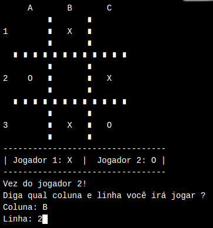

# Jogo Da Velha em Python
Simples jogo da velha feito em python e rodado no próprio terminal!

## Preview

## Como rodar?
É NECESSÁRIO TER PYTHON INSTALADO NA MÁQUINA:
- Git clone e execute "python jogoDaVelhaNoTerminal.py" no terminal!

SEM TER PYTHON INSTALADO:
- Copie o código diretamento no arquivo do gitHub e depois cole em algum site que compile Python online!
